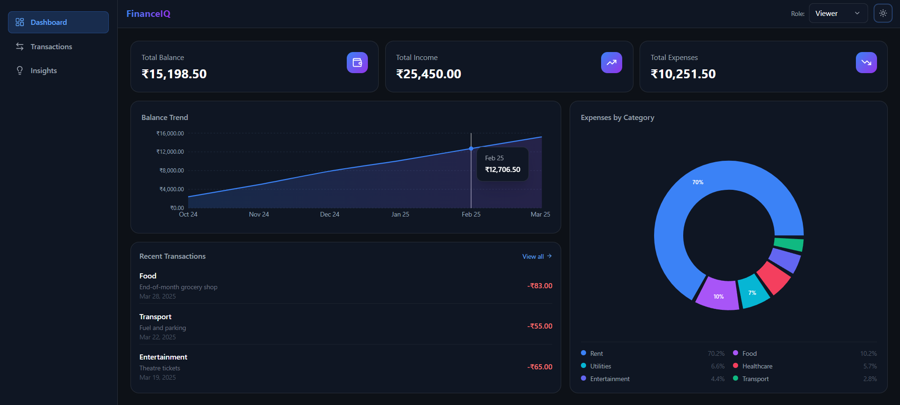
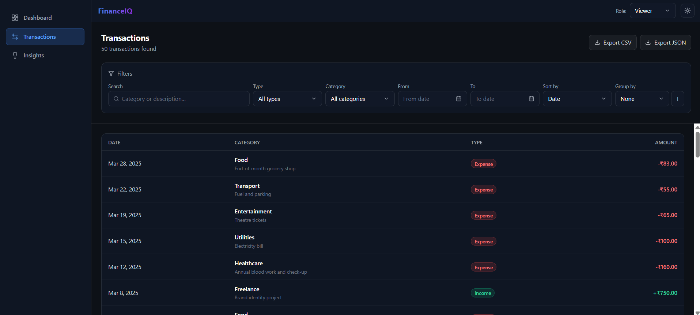
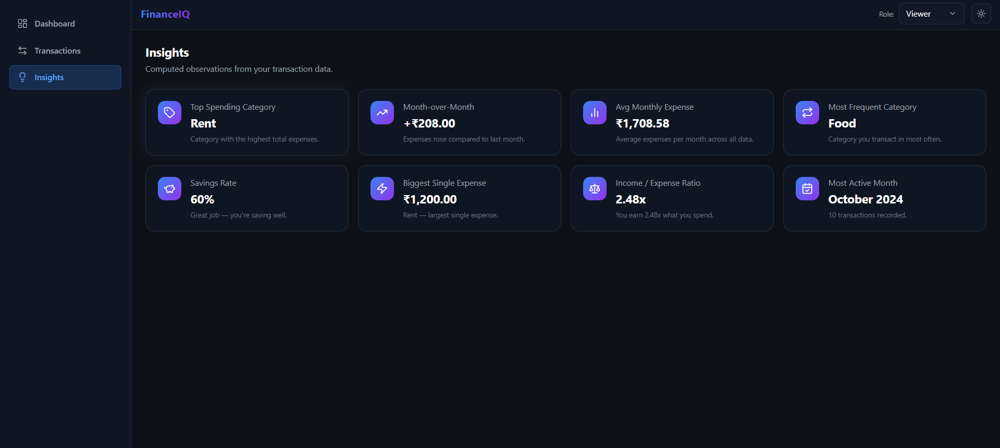

# Finance Dashboard

A personal finance visualization app built with React 18 and Tailwind CSS. It gives you a clean, interactive overview of income, expenses, and spending patterns — all powered by static mock data with no backend required.

---

## Screenshots



| Transactions                                         | Insights                                     |
| ---------------------------------------------------- | -------------------------------------------- |
|  |  |

---

## Features

- **Dashboard Overview** — Summary cards for Total Balance, Income, and Expenses with live recalculation
- **Charts** — Monthly balance trend (area chart) and expense breakdown by category (pie chart) via Recharts
- **Transactions** — Full table with search, multi-field filtering (type, category, date range), sorting by date or amount, and grouping by category or month
- **Role-Based UI** — Toggle between Viewer (read-only) and Admin (add/edit transactions) without any authentication
- **Insights** — Auto-computed observations: top spending category, month-over-month expense change, average monthly spend, most frequent category
- **Dark / Light Mode** — Smooth 300ms theme transition; dark is the default
- **Animations** — Framer Motion entrance animations on cards, charts, and insights; animated modal open/close; layout-animated transaction list reordering
- **Export** — Download the currently filtered transaction list as CSV or JSON
- **Responsive** — Mobile-first layout with a collapsible sidebar drawer, stacked card view for transactions on small screens, and proportionally resizing charts

---

## Tech Stack

| Layer            | Library / Tool                                    |
| ---------------- | ------------------------------------------------- |
| UI Framework     | React 18 (JSX)                                    |
| Routing          | React Router v6                                   |
| State Management | Zustand v5                                        |
| Styling          | Tailwind CSS v3                                   |
| Charts           | Recharts v2                                       |
| Animations       | Framer Motion v11                                 |
| Icons            | Lucide React                                      |
| Build Tool       | Vite                                              |
| Testing          | Vitest + React Testing Library + fast-check (PBT) |

---

## Getting Started

**Prerequisites:** Node.js 18+ and npm

```bash
# 1. Install dependencies
npm install

# 2. Start the dev server
npm run dev
```

Open [http://localhost:5173](http://localhost:5173) in your browser.

```bash
# Build for production
npm run build

# Preview the production build
npm run preview
```

---

## Project Structure

```
src/
├── components/
│   ├── charts/         # BalanceTrendChart, ExpensePieChart
│   ├── insights/       # InsightCard, InsightsPanel
│   ├── layout/         # Sidebar, Navbar, RoleToggle, ThemeToggle
│   ├── transactions/   # TransactionTable, TransactionRow, TransactionForm, FilterBar, ExportMenu
│   └── ui/             # SummaryCard, Modal, Badge, EmptyState
├── data/
│   └── mockTransactions.js   # 35 pre-seeded transactions across 6 months and 8 categories
├── pages/
│   ├── DashboardPage.jsx
│   ├── TransactionsPage.jsx
│   └── InsightsPage.jsx
├── store/
│   └── useFinanceStore.js    # Zustand store
├── utils/
│   ├── calculations.js       # Pure derived computations
│   ├── filterUtils.js        # Filter, sort, and group pipeline
│   ├── exportUtils.js        # CSV and JSON export helpers
│   └── formatters.js         # Currency and date formatters
└── App.jsx
```

---

## State Management

All application state lives in a single **Zustand store** (`store/useFinanceStore.js`). There is no server, no persistence layer, and no prop drilling.

The store holds four slices:

| Slice          | Description                                                                              |
| -------------- | ---------------------------------------------------------------------------------------- |
| `transactions` | The full list of transaction objects (seeded from mock data)                             |
| `filters`      | Active search query, type/category/date filters, sort field, sort direction, and groupBy |
| `role`         | Current simulated role — `"viewer"` or `"admin"`                                         |
| `theme`        | Current theme — `"dark"` or `"light"`                                                    |

Derived values (summary totals, chart data, insights) are **not stored** — they are computed on the fly by pure functions in `utils/calculations.js` and consumed directly by components. This keeps the store minimal and avoids stale derived state.

---

## Role-Based UI

Role switching is a UI simulation — there is no login or token involved.

- **Viewer** — Read-only access. Add and edit controls are hidden across the entire app.
- **Admin** — Full access. An "Add Transaction" button appears on the Transactions page, and each row shows an edit control. Form submissions are validated before the store is mutated.

Switch roles using the toggle in the top navbar. The UI updates instantly without a page reload.

---

## Mock Data

The app ships with 35 pre-seeded transactions spanning 6 months across 8 categories:

`Food · Rent · Salary · Entertainment · Transport · Healthcare · Freelance · Utilities`

Both `income` and `expense` types are represented. The data is defined in `src/data/mockTransactions.js` and loaded into the Zustand store on initialization.

---

## Pages

| Route           | Page         | Description                                             |
| --------------- | ------------ | ------------------------------------------------------- |
| `/`             | Dashboard    | Summary cards + balance trend chart + expense pie chart |
| `/transactions` | Transactions | Filterable, sortable, exportable transaction table      |
| `/insights`     | Insights     | Auto-computed spending observations and trends          |
